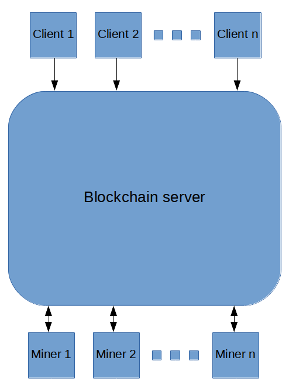
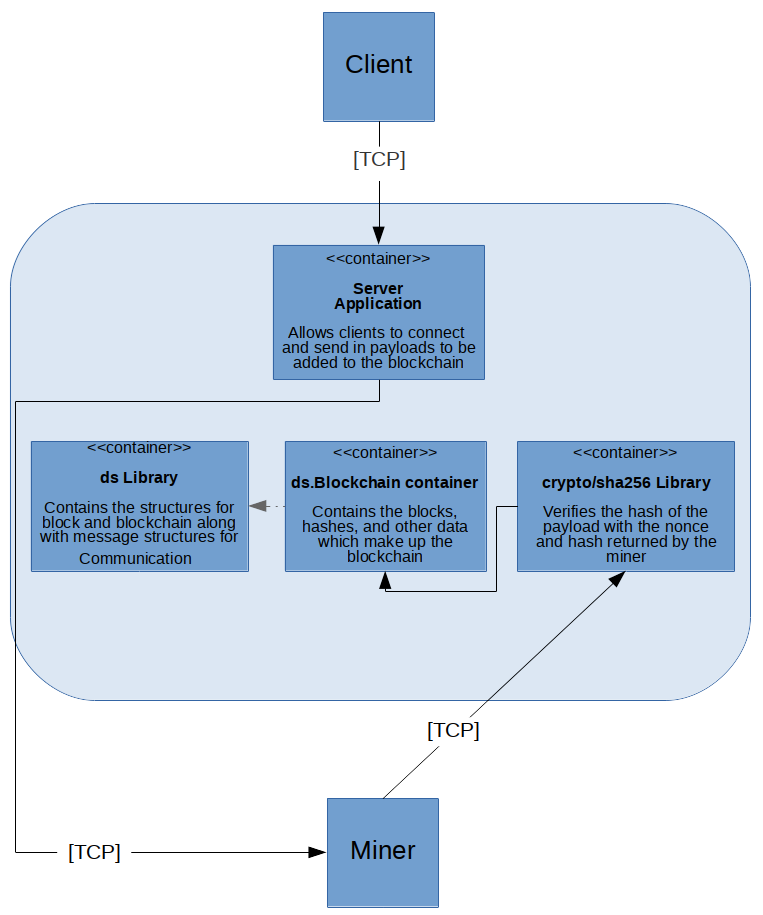
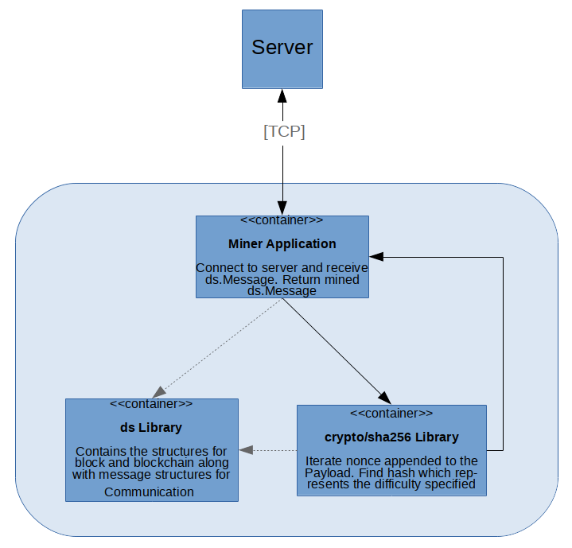
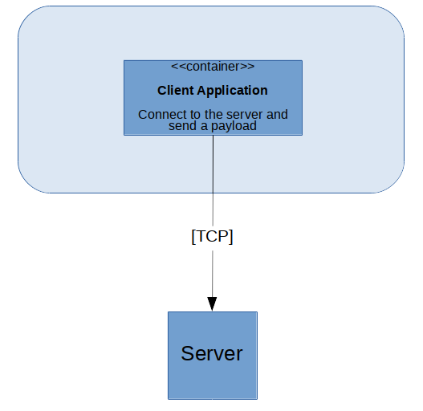

# Architecture documentation

## Project System Context Diagram

The project will have a central server which holds the blockchain data. It can have multiple clients connect to it to send it payloads which need to be added to the blockchain. It can also have multiple miners connected to it from which it will hold a competition to mine a specific block. Miners will send back the hash and nonce within a ds.Message object to the server. Server feedback to the client is in the [TODO list](../TODO.md).

## Server Container diagram

Simply put (not including its concurrent nature), the server will accept a connection from a client and a miner. The server will accept a gob of ds.Message from a client and will broadcast the ds.Message to all miners in the pool. The server will receive a gob of ds.Message back from the miner(s). It will use crypto/sha256 to verify the integrity of the computation done by the miner. It will then send it to the blockchain container  (which uses lib/ds) for processing and addition.

## Miner container diagram

A miner will connect to a server. It will receive a gob of ds.Message and then mine it. It will then send the result to the server if it doesn't get a stop signal.

## Client container diagram

A client will simply send a gob of string to a server. Feedback from the server is not yet handled and is in the [TODO list](../TODO.md).
